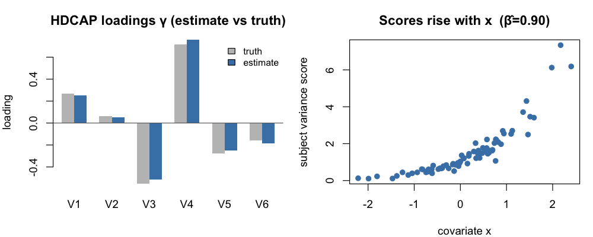
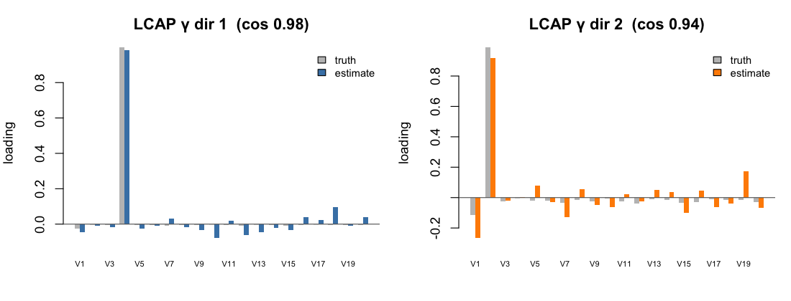
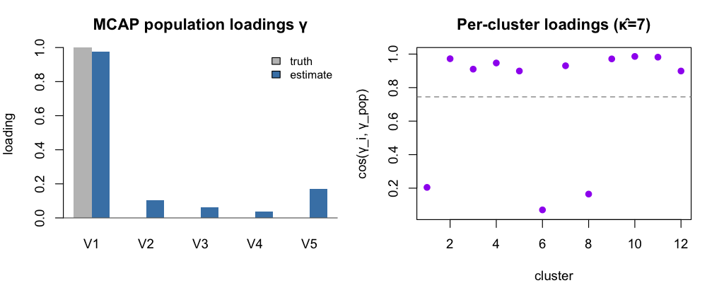
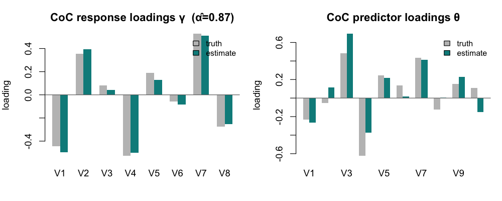
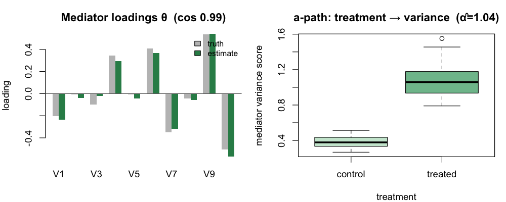
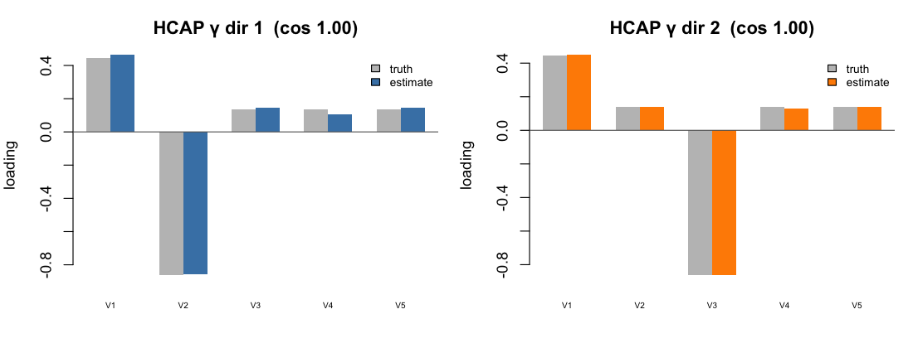
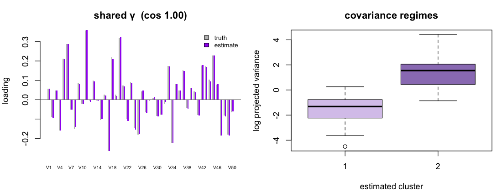

# Running the CAP methods — worked examples

Every method ships a built-in synthetic-data generator (`*_example()`) that
returns data in exactly the shape the wrapper expects, plus a `truth` element so
you can check the estimates. The
pattern is always:

```r
library(CAPmethods)
d   <- <method>_example()      # generate example data (+ ground truth in d$truth)
fit <- <method>(...)           # run the method on it
```

| Method | Fit wrapper | Example | Demonstrates |
|--------|-------------|---------|--------------|
| HDCAP | `hdcap()` | `hdcap_example()` | covariate → covariance magnitude (one direction) |
| LCAP | `lcap()` | `lcap_example()` | longitudinal, fixed + random effects |
| MCAP | `mcap()` | `mcap_example()` | multilevel, cluster-varying loadings |
| CAP-CoC | `coc()` | `coc_example()` | covariance-on-covariance regression (manuscript sim) |
| CAP-mediation | `capmediation()` | `capmediation_example()` | covariance mediator (GMed sim) |
| HCAP | `hcap()` | `hcap_example()` | high-dimensional covariates (regularization + post-selection inference) |
| CAP-clustering | `cappcl()` | `cappcl_example()` | clustering covariance patterns |

All figures below are produced by the code shown (base graphics, no extra
packages). γ "loadings" are sign-invariant, so estimates are sign-aligned to the
truth before plotting; cosine similarity to the truth is reported in each title.

---

## HDCAP — high-dimensional CAP

Relates a subject covariate to the **magnitude of variance** along a latent
direction γ: `log(γ′ Σᵢ γ) = xᵢ′ β`. With `cov.shrinkage = FALSE` this is the
classical CAP model; set `TRUE` (auto when `Tᵢ − 5 < p`) for the shrinkage
estimator.

**Data:** `X` is an `n × q` covariate matrix; `Y_list` is a length-`n` list of
`Tᵢ × p` response matrices.

```r
d   <- hdcap_example()                  # 80 subjects, p = 6, one covariate-driven direction
fit <- hdcap(d$Y_list, d$X, stop.crt = "nD", nD = 1, cov.shrinkage = FALSE)

fit$beta      # coefficient on the variance scale  → ~ c(0, 0.9)
fit$gamma     # estimated loading direction (p-vector)
```

Recovers the truth: **β̂ = (−0.01, 0.90)** vs the true `(0, 0.9)`, and the loading
**γ cosine ≈ 0.997**. The right panel shows each subject's variance score rising
with the covariate, exactly as `β > 0` implies.



---

## LCAP — longitudinal CAP (time-invariant projection)

A single time-invariant loading γ with a mixed model on the log-variance:
fixed effects β for time-varying covariates plus random intercept (σ²) and
random slopes (Ω). Visit `v` of subject `i` contributes a `Tᵢᵥ × p` matrix.

**Data:** `Y` is a nested list (subject → visit → `Tᵢᵥ × p`); `X` is a list of
`nVᵢ × q` covariate matrices (one row per visit).

```r
d   <- lcap_example()                   # 60 subjects × 6 visits, p = 6
fit <- lcap(d$Y, d$X, stop.crt = "nD", nD = 1, cov.shrinkage = FALSE, verbose = FALSE)

fit$beta          # fixed effects (Intercept, time, dose) → ~ c(0, -0.5, 0.6)
fit$beta0.sigma2  # random-intercept variance
fit$beta1.Omega   # random-slope covariance
```

Fixed effects recover the truth: **β̂ = (−0.01, −0.55, 0.63)** vs `(0, −0.5, 0.6)`;
**γ cosine ≈ 0.999**.



---

## MCAP — multilevel CAP (cluster-varying loadings)

Units nested in clusters; each cluster `i` has its **own** loading `γᵢ` drawn
around a population direction γ via a von Mises–Fisher distribution (concentration
κ). The log-variance has cluster random intercept/slopes.

**Data:** `Y` is a nested list (cluster → unit → `Tᵢⱼ × p`); `X2` is a list of
`nᵢ × q₂` random-effect covariate matrices (no intercept column).

```r
d   <- mcap_example()                   # 12 clusters × 15 units, p = 5
fit <- mcap(d$Y, X1 = NULL, X2 = d$X2, data.type = "Y",
            stop.crt = "DfD", DfD.thred = 2, method = "CAP",
            H.type = "CAvgCov", Omega.diag = TRUE, verbose = FALSE)

fit$gamma       # population loadings (p × nD)
fit$gamma.rnd   # per-cluster loadings (p × nD × m)
fit$kappa       # estimated vMF concentration
```

Population loading **γ cosine ≈ 0.98**. The right panel shows each cluster's
loading cosine to the population direction (their spread reflects κ̂).



---

## CAP-CoC — covariance-on-covariance regression

Regresses the **variance of an outcome covariance on the variance of a predictor
covariance**: `log(γ′ Σᵧᵢ γ) = α · log(θ′ Σₓᵢ θ) + β′ Wᵢ`. It jointly finds the
outcome direction γ, the predictor direction θ, the association α, and covariate
effects β. `coc()` runs the multi-direction selection (used here with `nD = 1`);
`coc_d1()` estimates a single component directly.

**Data:** `X` (predictor) and `Y` (outcome) are length-`n` lists of `Tₓ × p` and
`Tᵧ × q` matrices; `W` is an `n × r` covariate matrix.

The built-in example is the **case-1 simulation of Zhao et al. (Biometrics 2025)**:
`p = 10` predictor / `q = 5` outcome, with two covariance-on-covariance pairs —
predictor directions {1, 3} drive outcome directions {2, 4} with `α = (3, 2)` and
`β = ((1,−1),(−1,1))`. The recovering fit uses **identity weights** `Hy = diag(q)`,
`Hx = diag(p)` (the default average-covariance weight collapses to a background
direction), `burn.in = 200`, and covariance shrinkage; `nD = 1` recovers the
leading pair (the deflated 2nd direction is unstable).

```r
d <- coc_example()                       # 150 subjects; X is p = 10, Y is q = 5
p <- ncol(d$X[[1]]); q <- ncol(d$Y[[1]])
fit <- coc(d$Y, d$X, d$W, stop.crt = "nD", nD = 1,
           Hy = diag(q), Hx = diag(p),
           cov.shrinkage.y = TRUE, cov.shrinkage.x = TRUE,
           burn.in = 200, ninitial = 5, seed = 100, verbose = FALSE)

fit$alpha    # covariance-on-covariance association  → ~ 3 (leading pair)
fit$gamma    # outcome (Y) loadings
fit$theta    # predictor (X) loadings
fit$beta     # covariate effects  → ~ c(1, -1)
```

Recovers the leading pair: **α̂ = 2.89** (true 3), outcome **γ cosine ≈ 1.0**,
predictor **θ cosine ≈ 1.0**, and **β̂ = (1.20, −0.96)** vs the true `(1, −1)`.



---

## CAP-mediation — covariance mediator

Tests whether a treatment acts on an outcome **through the variance of a
multivariate mediator** along a latent direction θ: treatment → `log(θ′ Σᵢ θ)`
(the **a-path**) → `Y` (the **b-path**), alongside a direct treatment effect.
`coef` reports `alpha` (a-path), `beta` (b-path), `gamma`, `IE` (indirect /
mediation effect) and `DE` (direct effect) per direction; `*_boot()` adds
bootstrap inference.

**Data:** `X` is an `n × q` design (treatment + optional covariates); `M` is a
length-`n` list of `Tᵢ × p` mediator matrices; `Y` is a length-`n` outcome vector.

The built-in example has a binary treatment that shifts the mediator's variance
along two latent directions ({2, 4}), and the outcome depends on those
log-variances. `H` defaults to the average mediator covariance and
`Y.remove = FALSE`.

```r
d   <- capmediation_example()           # 100 subjects, p = 10, binary treatment
fit <- capmediation(d$X, d$M, d$Y, stop.crt = "DfD", DfD.thred = 2,
                    Y.remove = FALSE, verbose = FALSE)

fit$theta   # mediator loading direction(s)
fit$coef    # alpha (a-path), beta (b-path), gamma, IE, DE  per direction
```

The leading mediating direction is recovered: **θ cosine ≈ 0.99**, and the
treatment → mediator-variance **a-path α̂ ≈ 1.0** (true 1) — the right panel shows
the mediator's variance score rising under treatment. (The b-path / indirect
effect is attenuated at finite `Tᵢ` because the per-subject covariance is
estimated from `Tᵢ` rows, so the bootstrap companion `capmediation_boot()` is the
intended route for indirect-effect inference.)



---

## HCAP — high-dimensional-covariate CAP

Handles **many subject covariates** (`q` large) with sparse, `glmnet`-based
selection, returning `nD` response loadings and de-biased inference for the
covariate effects. This is the most expensive method (cross-validated lasso per
direction-iteration plus post-selection inference) — use modest sizes when exploring.

**Data:** `X` is an `n × q` covariate matrix (here `q = 60`); `Y_list` is a
length-`n` list of `Tᵢ × p` matrices (`p = 5`).

```r
d   <- hcap_example(n = 80, p = 5, q = 60, Ti = 60)   # ~1 min
fit <- hcap(d$X, d$Y_list, stop.crt = "nD", nD = 2, B = 5)

fit$gamma_est   # estimated loadings (p × nD)
fit$inference   # per-direction de-biased covariate inference
```

HCAP returns the `nD` directions as a basis of the signal subspace (any rotation
within it is equivalent), so compare the **2-D subspace**, not individual columns:
canonical correlations to the truth are **1.00 and 0.999** (essentially exact).
The figure shows the estimated basis after Procrustes-aligning it to the truth.



---

## CAP-clustering — clustering covariance patterns

Clusters subjects whose covariance follows **different covariate models**, sharing
a common loading γ, with cluster membership informed by covariates `W`
(multinomial via `brglm2`). Each cluster gets its own variance-covariate
coefficients.

**Data:** `Y` is a length-`n` list of `Tᵢ × p` matrices; `X` is an `n × q₁`
variance-covariate matrix; `W` is an `n × q₂` membership-covariate matrix.

```r
d   <- cappcl_example()                 # 80 subjects, p = 6, 2 covariance regimes
fit <- cappcl(d$Y, d$X, d$W, ncluster = 2, stop.crt = "nD", nD = 1)

fit$gamma   # shared loading direction
fit$class   # estimated cluster membership
fit$beta    # per-cluster variance-covariate coefficients
```

The shared loading is recovered (**γ cosine ≈ 0.99**); the right panel shows the
two covariance regimes capPCL separates (variance score by estimated cluster).



---

### Notes

- **Bootstrap inference.** `hdcap_boot()`, `lcap_boot()`, `mcap_boot()`,
  `coc_boot()`, `capmediation_boot()`, and `cappcl_boot()` add bootstrap standard
  errors / CIs for the coefficients; pass `sims =` to set the number of replicates.
- **Direction selection.** Most fits accept `stop.crt = "nD"` (fix the number of
  directions via `nD`) or `stop.crt = "DfD"` (data-driven via a `DfD.thred`).
- **Any internal function** of a method is reachable with
  `cap_internal("<method>", "<fn>")` — e.g. `cap_internal("coc", "COCReg.D1")`.
